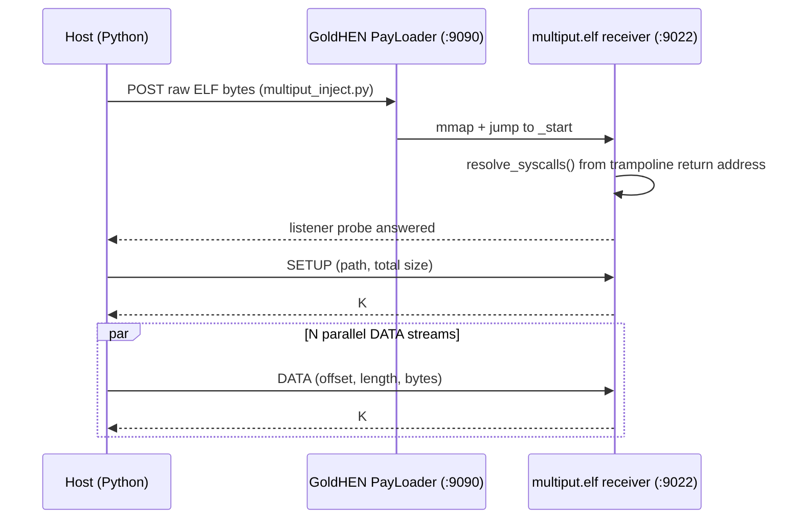

# PS4 MultiPut Overview

MultiPut pushes a large package file onto a jailbroken PlayStation 4 over
multiple parallel TCP streams, faster than a single-stream transfer over FTP
or [ps4-ftp](https://github.com/AlexAltea/ps4-ftp)-style tools. That is its
entire purpose: it is a bulk-copy accelerator, not a general remote-control or
file-management tool.

## Three-actor flow

1. **GoldHEN PayLoader** — an unauthenticated HTTP service on the console,
   default port 9090, that accepts a raw ELF over POST and executes it.
   `multiput_inject.py` uses this to launch the receiver; see
   [python-tooling.md](/openwiki/python-tooling.md).
2. **The receiver** (`src/multiput.c`, compiled to `multiput.elf`) — a
   freestanding, single-threaded, `poll(2)`-driven TCP server that listens on
   port 9022 (compile-time constant) and writes incoming bytes to a file under
   `/data/pkg/`. See [receiver.md](/openwiki/receiver.md).
3. **The Python sender** (`multiput_push.py`) — opens one SETUP connection to
   pre-size the destination, then splits the file into disjoint byte ranges
   and pushes each range over its own thread and its own DATA connection,
   1–64 streams. See [python-tooling.md](/openwiki/python-tooling.md).

The exact byte-level framing all three actors agree on is documented in
[wire-protocol.md](/openwiki/wire-protocol.md).

## No ps4debug dependency

The receiver needs to issue real PS4 syscalls (`open`, `pwrite`, `socket`,
`poll`, …), but it is loaded as a bare, unsigned payload with no libc, no CRT,
and no dynamic linker — GoldHEN PayLoader maps its `PT_LOAD` segments directly
and jumps to `_start` from a native libkernel thread trampoline. Retail PS4
firmware also enforces syscall-origin checks: a `syscall` instruction has to
execute from code mapped as part of libkernel, not from arbitrary payload
memory.

Earlier revisions solved this by having the host-side injector attach over
**ps4debug**, read the console's live process memory to find libkernel's
ASLR-randomized syscall stub addresses, and patch those addresses directly
into the ELF bytes before sending it — meaning a running ps4debug service on
the console was a hard prerequisite.

The current receiver instead resolves its own syscall stub addresses
entirely at runtime, using only its own entry-point context: it captures the
return address of the libkernel trampoline that invoked `_start`, and scans
backward through nearby memory for the exact byte pattern of a libkernel
syscall stub, for each of the twelve syscalls it needs. This removes the
ps4debug dependency completely. The scanning mechanism is documented in full
in [receiver.md](/openwiki/receiver.md).

## Trust boundary: `/data/pkg/` only, no authentication

MultiPut restricts every destination write to a normalized file path under
`/data/pkg/`. This boundary is enforced **twice, independently**:

- client-side, in `multiput_protocol.py`'s `validate_remote_path()`, before
  any bytes leave the sending host;
- receiver-side, in `multiput.c`'s `path_is_allowed()`, before the console
  opens or resizes any file.

Both checks exist because the wire protocol itself has none: MultiPut is
plaintext TCP with no authentication, no encryption, and no session token.
Reaching the receiver's port at all is the only thing being checked, and
the `/data/pkg/` restriction only bounds *where* a reachable peer can write,
not *whether* they're allowed to write. It is explicitly a trusted-LAN-only
tool — see the exact validation rules in
[wire-protocol.md](/openwiki/wire-protocol.md).

## Where to go next

- New to the repo: [quickstart.md](/openwiki/quickstart.md)
- Implementing or debugging the protocol: [wire-protocol.md](/openwiki/wire-protocol.md)
- How the console-side ELF runs without ps4debug: [receiver.md](/openwiki/receiver.md)
- Launcher and sender internals: [python-tooling.md](/openwiki/python-tooling.md)
- Cross-compiling and cutting a release: [build-and-release.md](/openwiki/build-and-release.md)
